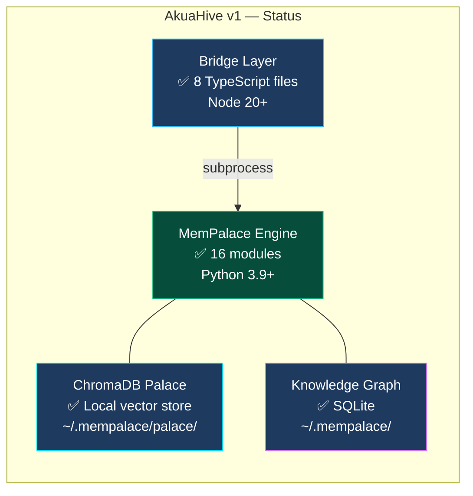
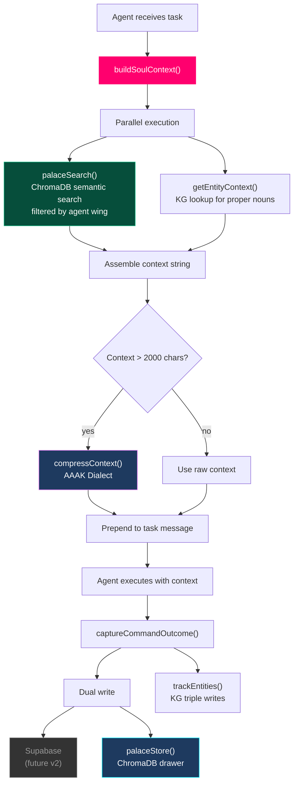

# AkuaHive — Project Status

**Version:** 1.0.0
**Date:** 2026-04-07
**Branch:** main

---

## System Health

---

## Component Status

| Component | Status | Version | Notes |
|-----------|--------|---------|-------|
| **MemPalace Engine** | ✅ Stable | 3.0.0 | 16 Python modules, PyPI-compatible |
| **Bridge Layer** | ✅ v1 Complete | 1.0.0 | 8 TypeScript files, subprocess adapter |
| **Palace Adapter** | ✅ Working | — | search, store, compress, entities, KG query, status |
| **Soul Context** | ✅ Working | — | buildSoulContext() with palace L3 fallback |
| **AAAK Compression** | ✅ Working | — | ~30x compression on structured text |
| **Knowledge Graph** | ✅ Working | — | Entity detection + temporal triples |
| **ChromaDB Store** | ✅ Working | — | Semantic vector search across drawers |
| **Supabase Integration** | 🔲 Not started | — | v2: dual-read from Supabase + Palace |
| **On-Chain Anchoring** | 🔲 Not started | — | v2: IPFS + Base Mainnet via XmetaV pattern |
| **Dream Mode** | 🔲 Not started | — | v2: idle consolidation from palace data |
| **MCP Upgrade** | 🔲 Not started | — | v2: replace subprocess with MCP stdio |
| **Dashboard UI** | 🔲 Not started | — | v2: palace browser in XmetaV dashboard |

---

## What Works Today

---

## Integration Points with XmetaV

| XmetaV Component | AkuaHive Equivalent | Status |
|-----------------|---------------------|--------|
| `soul/context.ts` → `buildSoulContext()` | `bridge/lib/soul/context.ts` | ✅ Adapted |
| `soul/retrieval.ts` → keyword scoring | `palaceSearch()` → semantic search | ✅ Upgraded |
| `agent-memory.ts` → `captureCommandOutcome()` | `palaceStore()` dual-write | ✅ Ready |
| `soul/types.ts` → `SoulConfig` | `bridge/lib/soul/types.ts` + palace config | ✅ Extended |
| `memory_associations` table | Knowledge graph triples | ✅ Different approach, same goal |
| `soul/dream.ts` → idle consolidation | Not yet | 🔲 v2 |
| `memory-anchor.ts` → IPFS + Base | Not yet | 🔲 v2 |
| Supabase Realtime → dashboard sync | Not yet | 🔲 v2 |

---

## Roadmap

### v1.0 (Current) — Local Memory Bridge
- [x] Python subprocess adapter
- [x] Palace semantic search in Soul context
- [x] AAAK compression pipeline
- [x] Entity detection + KG tracking
- [x] Agent → wing routing
- [x] CLAUDE.md engineering guide
- [x] Design spec

### v2.0 — XmetaV Full Integration
- [ ] Supabase dual-read (palace + Postgres)
- [ ] On-chain anchoring for palace drawers
- [ ] Dream mode using palace + KG data
- [ ] MCP stdio upgrade (replace subprocess)
- [ ] Dashboard palace browser page
- [ ] Association reinforcement from palace hits

### v3.0 — Fleet Intelligence
- [ ] Cross-agent entity resolution (KG unifies mentions)
- [ ] Palace-powered dream insights
- [ ] AAAK-compressed on-chain anchors (denser IPFS blobs)
- [ ] Real-time KG sync to Supabase for dashboard queries
