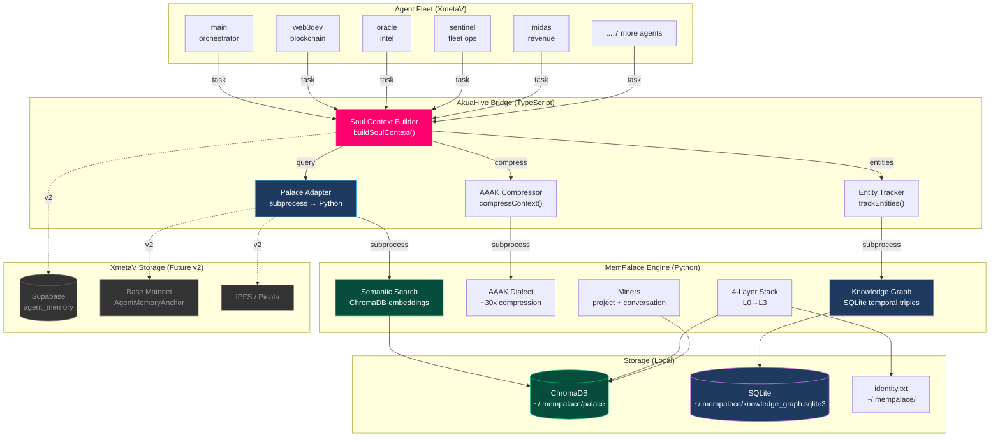
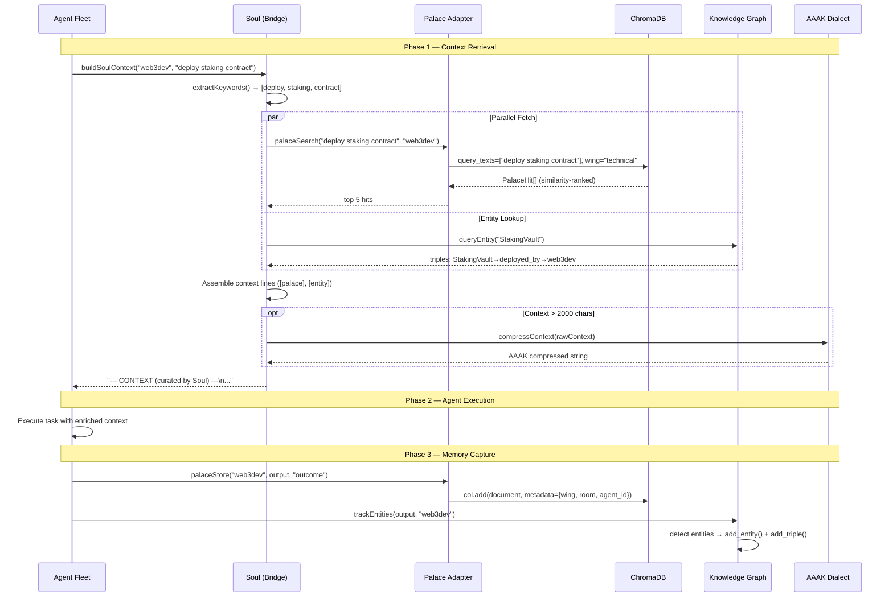
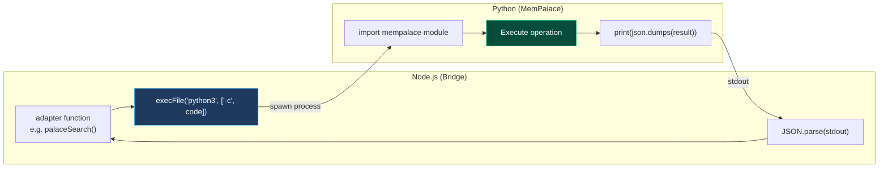
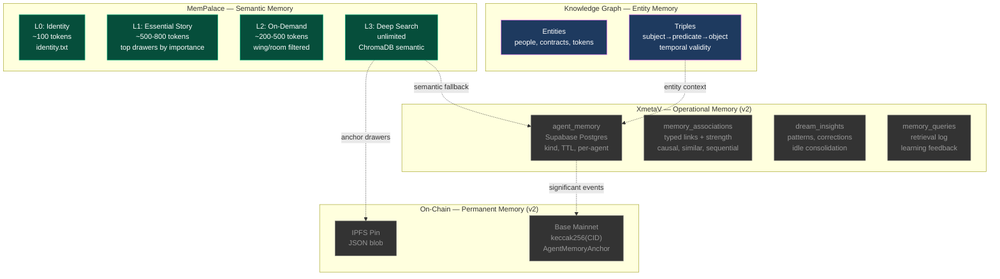
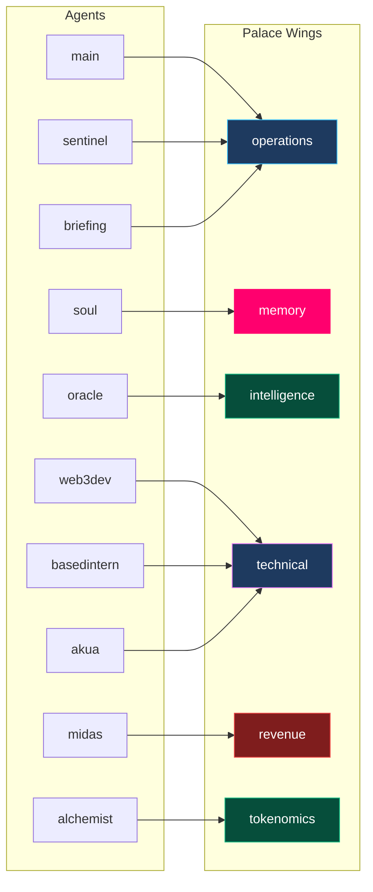
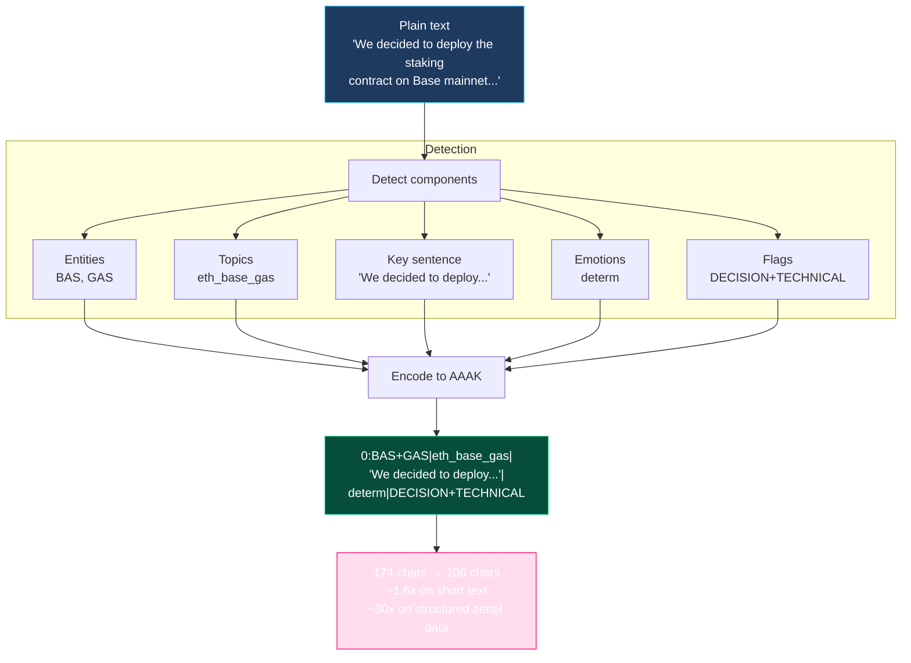
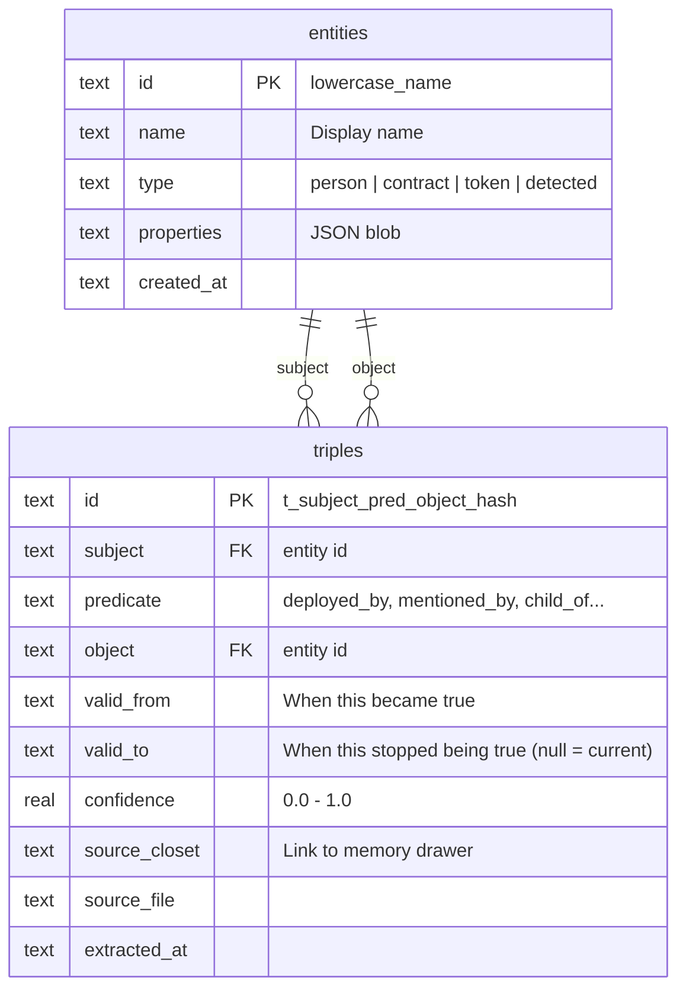
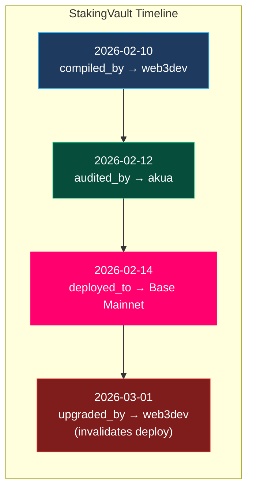

# AkuaHive — Architecture

> Two memory systems, one orchestration layer, zero cloud dependencies.

---

## The Big Picture

AkuaHive merges MemPalace (local AI memory engine) with XmetaV (multi-agent fleet orchestration) through a TypeScript bridge. MemPalace handles storage and retrieval. The bridge handles curation and routing. Agents get richer context without knowing where it came from.



---

## Data Flow — Command Lifecycle

Every agent task follows this path through the system:



---

## The Subprocess Bridge

All TypeScript ↔ Python communication uses one pattern:



**Properties:**
- ~200ms per call (process spawn + import + operation)
- 5s timeout, non-fatal
- 1MB max buffer per response
- No persistent connection — stateless calls
- `PYTHONDONTWRITEBYTECODE=1` to avoid .pyc clutter

---

## Memory Hierarchy

AkuaHive has two complementary memory systems. They serve different purposes and will merge in v2.



### How They Merge (v2 Plan)

| Memory Type | v1 (Now) | v2 (Planned) |
|------------|----------|-------------|
| **Short-term** (task outcomes, errors) | Palace drawers only | Supabase `agent_memory` + Palace dual-write |
| **Long-term** (facts, goals) | Palace drawers + KG | Supabase (permanent TTL) + Palace + KG |
| **Semantic** (meaning-based recall) | Palace ChromaDB search | Palace search as L3 fallback for Soul scoring |
| **Relational** (entity connections) | KG SQLite triples | KG triples + Supabase `memory_associations` |
| **Consolidated** (patterns, insights) | Not yet | Dream mode reads Palace + KG, writes `dream_insights` |
| **Permanent** (on-chain) | Not yet | Anchor significant Palace drawers to IPFS + Base |

---

## Agent → Wing Routing

When an agent writes or searches memory, the bridge routes to the correct palace wing:



Wings are search filters, not hard partitions. An agent can search across all wings — the wing mapping just gives Soul a relevance hint.

---

## AAAK Compression Pipeline

The AAAK Dialect compresses plain text into a symbolic format any LLM reads natively:



**When compression fires:** Only when Soul context exceeds 2000 characters. Short contexts pass through uncompressed — the overhead isn't worth it for small payloads.

---

## Knowledge Graph — Entity Memory

The KG tracks entities and their relationships across all agent interactions:



**Temporal validity** is the key differentiator. The KG knows *when* facts were true:



---

## File Map

```
AkuaHive/
│
├── mempalace/                    # Python memory engine (standalone)
│   ├── __init__.py               # v3.0.0
│   ├── cli.py                    # CLI: init, mine, search, compress, wake-up
│   ├── config.py                 # MempalaceConfig, palace path, topic wings
│   ├── searcher.py               # search() + search_memories() — ChromaDB
│   ├── layers.py                 # MemoryStack: L0 identity → L3 deep search
│   ├── dialect.py                # AAAK Dialect: compress(), encode_zettel()
│   ├── knowledge_graph.py        # KnowledgeGraph: entities + temporal triples
│   ├── palace_graph.py           # BFS traversal, tunnel finding
│   ├── miner.py                  # Project file → ChromaDB drawers
│   ├── convo_miner.py            # Conversation → ChromaDB (Q+A chunking)
│   ├── normalize.py              # 5 chat format normalizer
│   ├── entity_detector.py        # Regex entity detection with signal scoring
│   ├── entity_registry.py        # Entity lookup/disambiguation
│   ├── general_extractor.py      # Memory type extraction (decisions, milestones...)
│   ├── onboarding.py             # Interactive setup flow
│   ├── mcp_server.py             # MCP stdio server (19 tools)
│   ├── spellcheck.py             # Spell correction preserving entities
│   ├── split_mega_files.py       # Split concatenated transcripts
│   └── room_detector_local.py    # Auto-detect rooms from folder structure
│
├── bridge/                       # TypeScript orchestration (AkuaHive glue)
│   ├── lib/
│   │   ├── index.ts              # Public API — import from here
│   │   ├── palace/
│   │   │   ├── adapter.ts        # Python subprocess: search, store, compress, entities
│   │   │   ├── types.ts          # PalaceHit, PalaceConfig, agent→wing map
│   │   │   └── index.ts          # Re-exports
│   │   └── soul/
│   │       ├── context.ts        # buildSoulContext() — the main brain
│   │       ├── types.ts          # SoulConfig, ContextPacket, ScoredMemory
│   │       └── index.ts          # Re-exports
│   ├── dist/                     # Compiled JS (gitignored)
│   ├── package.json
│   └── tsconfig.json
│
├── docs/
│   ├── STATUS.md                 # Project status and roadmap
│   ├── architecture/
│   │   └── README.md             # This file — system architecture
│   └── specs/
│       └── 2026-04-07-akuahive-v1-design.md
│
├── tests/                        # Python tests
├── CLAUDE.md                     # Engineering guide for Claude Code
├── pyproject.toml                # Python package config
└── README.md                     # User-facing documentation
```

---

## Next

- [Project Status](../STATUS.md) — Component status, integration points, roadmap
- [v1 Design Spec](../specs/2026-04-07-akuahive-v1-design.md) — Original design decisions
- [CLAUDE.md](../../CLAUDE.md) — Engineering rules and quick reference
